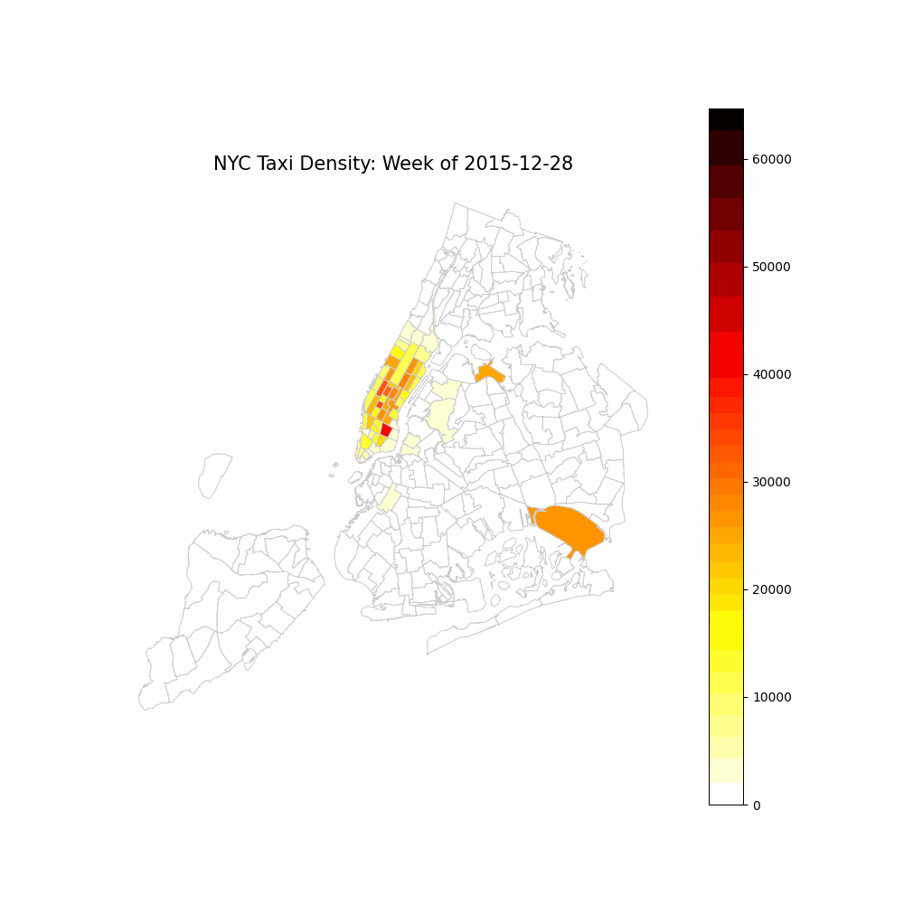
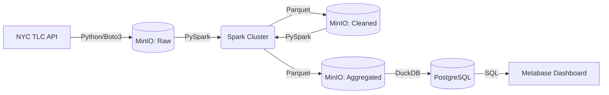
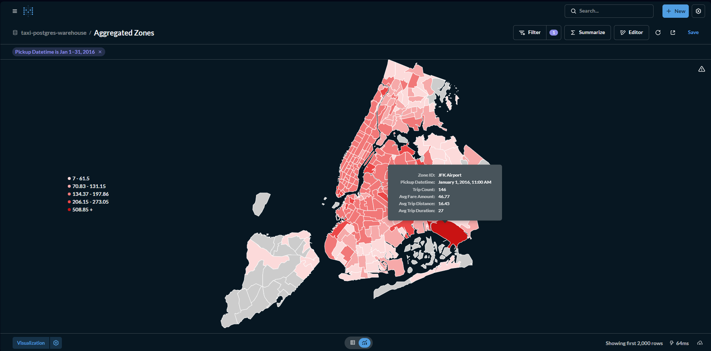

# 🚖 NYC Taxi Big Data Pipeline (2016)
**End-to-End Batch Processing | 130+ Million Records | Distributed Compute**


## Executive Summary
An automated, containerized ELT pipeline that ingests, cleans, and aggregates **12 months of NYC Yellow Taxi data** (~130 million trips). Designed for scalability, the architecture utilizes a local S3-compatible Data Lake (MinIO) and distributed processing (Apache Spark) to overcome single-machine memory constraints.

The final output serves a BI Dashboard (Metabase) and generates programmatic geospatial heatmaps.

### Result: 2016 NYC Traffic Timelapse
*(Generated via Python/GeoPandas from the fully processed Data Warehouse)*


---

## Architecture
The pipeline enforces a strict separation of compute and storage, mirroring enterprise-grade cloud architectures.



### Data Lineage
1. **Ingest (Airflow/Python):** Bypasses CloudFront anti-bot protection to stream raw Parquet files directly into MinIO.
2. **Transform (Spark):** Filters bad GPS data, removes time-traveling records (dropoff < pickup), and calculates trip durations.
3. **Aggregate (Spark):** Groups 10M+ monthly rows into hourly metrics per taxi zone (300x size reduction).
4. **Load (DuckDB):** Streams aggregated Parquet directly from MinIO into Postgres memory without pandas bottlenecks.
5. **Visualize (Metabase):** Renders custom GeoJSON map bindings.

---

## Engineering Challenges & Solutions

| Challenge | Solution |
|-----------|----------|
| **OOM Errors (Out of Memory)** | **Distributed Compute.** Standard Python/Pandas crashes on 2GB files. Apache Spark handles memory spillage and partitioned reads. |
| **Idempotency** | **Overwrite Logic.** Rerunning the DAG does not duplicate data. Upstream tasks overwrite S3 keys; downstream tasks use `DELETE FROM` before `INSERT`. |
| **S3 Network Bottleneck** | **DuckDB Ingestion.** Instead of pulling data to Airflow then pushing to Postgres, DuckDB acts as a bridge, streaming Parquet directly to SQL. |
| **Host/Container Path Leaks** | **Hardcoded Linux Overrides.** Fixed Docker Desktop WSL2 path injection bugs by rebuilding Airflow images with strict ENTRYPOINT overrides. |

---

## How to Run Locally

### Prerequisites
* Docker Desktop (Allocated at least 8GB RAM / 4 CPUs)
* **Windows Users:** You must disable Windows PATH injection in `.wslconfig`:
  ```ini
  [wsl2]
  appendWindowsPath=false
  ```

### Startup
1. Clone the repository and configure credentials:
   ```bash
   git clone https://github.com/YOUR_USERNAME/nyc-taxi-pipeline.git
   cd nyc-taxi-pipeline
   cp .env.example .env # (Edit with your secrets)
   ```
2. Build custom images and launch:
   ```bash
   docker-compose up -d --build
   ```
3. Initialize the Airflow/Spark connection:
   ```bash
   docker exec airflow-webserver airflow connections add "spark_default" --conn-type "spark" --conn-host "spark://spark-master:7077"
   ```
4. Access UIs:
   * **Airflow:** `http://localhost:8081` (Trigger the DAG here)
   * **Spark Master:** `http://localhost:8080`
   * **MinIO:** `http://localhost:9001`
   * **Metabase:** `http://localhost:3000`

## Dashboard Snapshot

*Static dashboard showing peak hours, top revenue zones, and outlier detection.*
```
